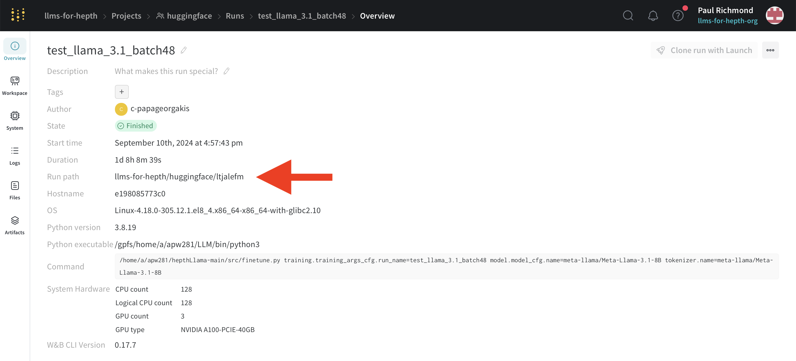

# FeynTune

---

A pipeline for finetuning LLMs on arXiv abstracts using
the 🤗 Hugging Face Transformers library. The aim is to
have a trained model that is able to complete unseen hep-th category arXiv
abstracts.

## Setup Instructions

---

1. Setup necessary accounts & hardware:

   Create a [Hugging Face account](https://huggingface.co/join) to access gated LLMs, private models, and datasets.
   A [Weights & Biases (W&B) account](https://wandb.ai/site) is also recommended for training.

   Both training and inference are compute-intensive, so ensure access to an Nvidia GPU with sufficient VRAM.
   We recommend hardware like the Ampere family GPUs with at least 40GB RAM, such as those available on
   the Sulis cluster ([https://sulis-hpc.github.io](https://sulis-hpc.github.io)).

2. Clone the repository:

   To clone the repository into an existing directory called `repos`, use the following commands:
   ```shell
   cd ~/repos
   git clone https://github.com/Paul-Richmond/FeynTune.git
   ```
   Alternatively, use SSH:
   ```shell
   cd ~/repos
   git clone git@github.com:Paul-Richmond/FeynTune.git
   ```

3. Create the environment:

   Use the provided script on Sulis to set up a new virtual environment named `vllm_take2`
   and install the packages listed in `vllm3_freeze.txt`.

   Execute the script by logging into Sulis and running the following command:
   ```shell
   sbatch /repos/FeynTune/sulis/llmenv.slurm
   ```

4. Add API keys using a `.env` file:

    - Create a `.env` file in the project root:
        ```bash
        touch .env
        ```
    - Add your API keys to the `.env` file with the following format:

        ```
        HUGGINGFACE_API_KEY=your_hf_api_key_here
        WANDB_API_KEY=your_wb_api_key_here
        ```

      > 💡 Avoid wrapping values in quotes unless special characters require escaping.

## Quickstart

---

The main scripts are

- `src/finetune.py`: the script for fine-tuning a pre-trained base LLM
- `src/infer_hf.py`: the script for running inference on a base or fine-tuned LLM

Scripts used for evaluation are

- `src/get_perplexity.py`:
- `src/score.py`:
- `src/sem_score.py`:
- `src/jina_score.py`:

Some example shell scripts are found in `sulis/`.

## Model fine-tuning and inference

---

This codebase implements a fine-tuning and inference system for open-weight large language models and uses
[Hydra](https://hydra.cc) for configuration management, allowing for modular and flexible experiment setup.

### 1. Core Architecture

The system follows a modular architecture where:

1. Configuration is managed through Hydra's hierarchical YAML files
2. Model training is orchestrated via the `finetune.py` script
3. Inference is performed through the `infer_hf.py` script
4. Utility functions handle data loading, model instantiation, and optimization

### 2. Hydra Configuration System

Hydra is central to this codebase's design, providing a powerful way to configure and
parameterize training and inference runs:

#### Configuration Structure

The configuration files are organized in a hierarchical directory structure:

```
configs/
├── default.yaml             # Main entry point for training
├── default_infer.yaml       # Main entry point for inference
├── callbacks/
│   └── callbacks.yaml       # Custom callbacks
│   └── none.yaml            # Empty file to turn off custom callbacks
├── dataset/
│   └── full.yaml            # Dataset configuration
│   └── small.yaml           # Use first 10% of dataset
├── inference/
│   └── infer.yaml           # Inference parameters
├── model/
│   └── model.yaml           # Model, quantization and LoRA configurations
├── optimizer/
│   └── adamw.yaml           # AdamW optimizer configuration
├── tokenizer/
│   └── tokenizer.yaml       # Tokenizer configuration
└── training/
    └── training_args.yaml   # Training parameters
```

- `configs/default.yaml`: The entry point configuration for training that composes other config modules
- `configs/default_infer.yaml`: The entry point configuration for inference that composes other config modules
- Specialized configuration modules organized by function:
    - `dataset/`: Dataset configurations like SemEval
    - `model/`: Model architecture settings (using Llama-2-7b-chat)
    - `optimizer/`: Optimizer configurations (AdamW settings)
    - `training/`: Training parameters (epochs, evaluation strategy, etc.)
    - `inference/`: Inference settings for model generation

#### How Hydra Works in This Codebase

1. **Configuration Composition**: The `@hydra.main` decorator in both `finetune.py` and `infer_hf.py` loads
   configurations from multiple YAML files, merging them into a unified `DictConfig` object.

2. **Default Configuration**: `configs/default.yaml` specifies which configuration modules to include by default
   through its `defaults` list:
   ```yaml
   defaults:
     - optimizer: adamw
     - dataset: full
     - model: model
     - tokenizer: tokenizer
     - training: training_args
     - callbacks: callbacks
     - _self_
   ```

   Similarly, `configs/default_infer.yaml` includes inference-specific configurations:
   ```yaml
   defaults:
     - dataset: full
     - inference: infer_hf
     - _self_
   ```

3. **Configuration Resolution**: Hydra resolves references between config files (using the `${...}` syntax)

4. **Run Directory Management**: Hydra automatically creates output directories for each run with timestamps:
   ```yaml
   hydra:
     run:
       dir: outputs/${now:%Y-%m-%d}/${now:%H-%M-%S}-${training.training_args_cfg.run_name}
   ```

5. **Instantiating Objects**: Hydra provides hydra.utils.instantiate() for instantiating objects. The config passed to
   this function must have a key called `_target_`, with the value of a fully qualified class name.

### 3. How to use Hydra overrides

Overrides can be checked by executing:

```bash
python src/print_hydra_cfg.py --cfg job --resolve --config-name [config_name] [overrides]
```

Replace `[config_name]` with either `default` or `default_infer` and `[overrides]` with your desired
configuration overrides. This command will print the entire resulting
configuration to the terminal, allowing you to verify and debug the settings.

#### Basic Syntax

The basic syntax for overriding a configuration value is:

```bash
python script.py config_group.config_name.param=value
```

Hydra provides several special operators:

- `~` - Remove a configuration value (e.g.: `~dataset.splits.train=train`)
- `+` - Append a config value
- `++` - Append or override a config value

#### Common Override Patterns

- Override Simple Values

```bash
python3 finetune.py dataset.name=LLMsForHepth/hep-ph_gr-qc_primary
```

- Override Nested Configurations

```bash
python3 finetune.py training.training_args_cfg.run_name=lastest_run
```

- Override Lists/Dictionaries

```bash
python3 finetune.py model.lora_cfg.target_modules='[q_proj, k_proj, v_proj]'
```

- Change Entire Configuration Files

```bash
python3 finetune.py dataset=small
```

- Multiple Overrides

```bash
python3 finetune.py model.model_cfg.name=meta-llama/Llama-2-7b-hf \
tokenizer.name=meta-llama/Llama-2-7b-hf \
training.training_args_cfg.run_name=Llama-2-7b_ft \
model.lora_cfg.target_modules='[q_proj, k_proj, v_proj]' \
training.training_args_cfg.num_train_epochs=5
```

### 4. Setting a training configuration

---

The file `sulis/finetune.slurm` contains an example shell script that demonstrates how to fine-tune Meta's LLama 3.1 8B
model using a dataset named `LLMsForHepth/hep-ph_gr-qc_primary`, with only the `q_proj`, `k_proj`, and `v_proj` layers
unfrozen.

A key requirement is specifying a `run_name` parameter in the `training_args` YAML configuration.
This `run_name` is used for tracking in Weights & Biases (W&B) and, through Hydra's resolution, determines
the Hugging Face upload repository name.

To start fine-tuning, run the following command:

```bash
python3 src/finetune.py training.training_args_cfg.run_name=my_run_name [other_overrides]
```

Alternatively, you can create new YAML files in the appropriate `configs` subdirectories to
override entire configuration settings and customize the setup as needed.

### 5. Recommencing Training from a Checkpoint

---

If training is interrupted, it can be resumed from a saved checkpoint. To do this, set the `resume_from_checkpoint`
parameter in `configs/training/training_args.yaml` to `true` or provide the local path to the saved checkpoint (see the
`Trainer.train` documentation [here](https://huggingface.co/docs/transformers/main_classes/trainer) for more details).
This can also be achieved by adding Hydra overrides in the launch script:

```bash
training.resume_from_checkpoint=true \
training.training_args_cfg.eval_on_start=false
```

To continue logging on Weights & Biases (W&B), add the following lines to your shell script:

```bash
export WANDB_RESUME=allow
export WANDB_RUN_ID=your_wandb_run_id
```

Here, `your_wandb_run_id` can be found on the Overview pane of the W&B run page, as shown below:
 **Note:** Only the final part of the path is required.

See `sulis/finetune.slurm` for an example implementation. For further details on resuming W&B runs, refer to
the [official documentation](https://docs.wandb.ai/guides/runs/resuming).

### 6. Setting an inference configuration

---

The inference script, `src/infer_hf.py`, is used to generate completions for abstracts in a dataset. The process
involves truncating each abstract to form prompts, which are then passed to the model's `generate` method. The resulting
completions are added back to the dataset and uploaded to Hugging Face.

To run the script, you’ll need a dataset of abstracts and a configuration file. Default configuration files are provided
at `configs/default_infer.yaml`, `configs/dataset/full.yaml`, and `configs/inference/infer.yaml`.

As only the test dataset split is needed for inference, use the following Hydra override to exclude the training
split:

```bash
~dataset.splits.train=train
```

The configuration file defines key parameters such as the model name, generation settings (passed to
the model's `generate` method), and the repository name for the appended dataset.

Here is an example command to run the inference script:

```bash
python3 src/inference.py ~dataset.splits.train=train \
                         inference.model_name=LLMsForHepth/s1-L-3.1-8B-base
```

## Evaluation

---

### Perplexities

The script `src/get_perplexitites.py` calculates the individual
perplexity of sequences. It accepts the following command-line arguments:

| Argument       | Flag               | Type            | Default      | Description                                                          |
|----------------|--------------------|-----------------|--------------|----------------------------------------------------------------------|
| `dataset_repo` | (positional)       | string          | Required     | Hugging Face dataset repository                                      |
| `adapters`     | `-a, --adapters`   | list of strings | None         | Optional adapters to use (e.g., `llama`, `s1-s10`, `s1_qkv-s10_qkv`) |
| `column`       | `-c, --column`     | string          | `"abstract"` | Dataset column to tokenize                                           |
| `batch_size`   | `-b, --batch_size` | integer         | `12`         | Batch size                                                           |
| `no_base`      | `-nb, --no_base`   | flag            | `False`      | Disable evaluation using the base model in `BASE_MODEL_REPO`         |

The adapter-to-model mapping is defined in the `ADAPTER_TO_REPO` dictionary.

For example:

```bash
python3 src/get_perplexities.py 'LLMsForHepth/hep-th_perplexities' -a s1_qkv s10_qkv -nb
```

This command processes the `abstract` column of the test split from the `LLMsForHepth/hep-th_perplexities` dataset
and computes perplexities using the models `LLMsForHepth/s1-L-3.1-8B-qkv_v2` and `LLMsForHepth/s10-L-3.1-8B-qkv`.

The computed perplexities are added to the dataset and uploaded to Hugging Face at `LLMsForHepth/hep-th_perplexities`.
To change the upload destination, modify the `UPLOAD_REPO` parameter accordingly.

**Note:** This script does not require running inference beforehand.

### Cosine Similarities

#### Pairwise Cosine Similarity

The pairwise cosine similarity metric is used to measure the similarity between embeddings of sequences within a
dataset. It calculates the cosine similarity values of all pairs of sequence embeddings, producing a similarity matrix.
This metric is useful for understanding how closely related sequences are in the embedding space, with a score of `1`
indicating perfect similarity, `-1` indicating perfect dissimilarity, and `0` indicating no correlation.

The embeddings are generated using the specified model, and the pairwise cosine similarity is computed for all entries
in the specified dataset column. The resulting similarity matrix is then saved for further analysis.

This metric is computed using the script `src/score.py` and accepts the same command-line arguments as
`src/get_perplexities.py`.

**Example:**

```bash
python3 src/score.py 'LLMsForHepth/hep-th_primary' -a s1_qkv s10_qkv -nb
```

The command above computes the pairwise cosine similarity matrix for the embeddings of the `abstract` column in the
test split of the `LLMsForHepth/hep-th_primary` dataset, using models specified in the adapter list.
The matrix of pairwise cosine similarities is saved as a `.pt` file.

**Note:** This script does not require running inference beforehand.


#### SemScore

We have implemented the metric described in 2401.17072: "SEMSCORE: Automated Evaluation of Instruction-Tuned LLMs 
based on Semantic Textual Similarity".

The `sentence-transformers/all-mpnet-base-v2` model is used to compute embeddings for each ground truth and its
corresponding predicted completion generated during inference. The cosine similarity between these embedding vectors is
then calculated for each entry in the dataset to quantify the semantic similarity.

The script `src/sem_score.py` processes the test split of the dataset `LLMsForHepth/hep-th_infer`, iterating through
each 'completion' column created by the `src/infer_hf.py` inference script. It appends new columns with the computed
semantic similarity scores to the dataset and uploads the updated version to Hugging Face at
`LLMsForHepth/sem_scores_hep_th`.

**Prerequisite:** Ensure the inference script `src/infer_hf.py` has been run beforehand to generate the required 
'completion' columns.

